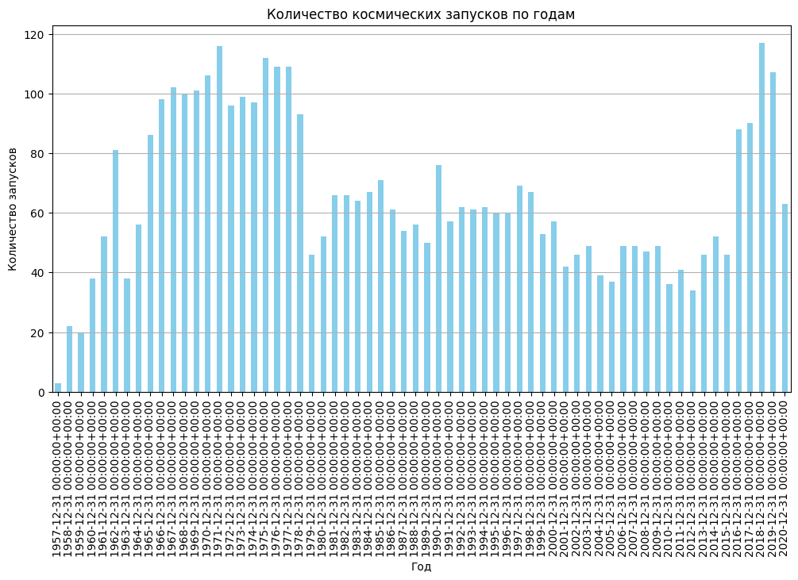
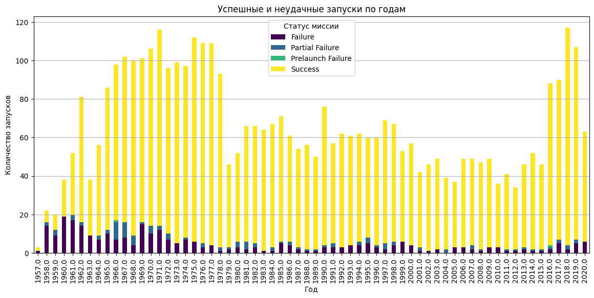
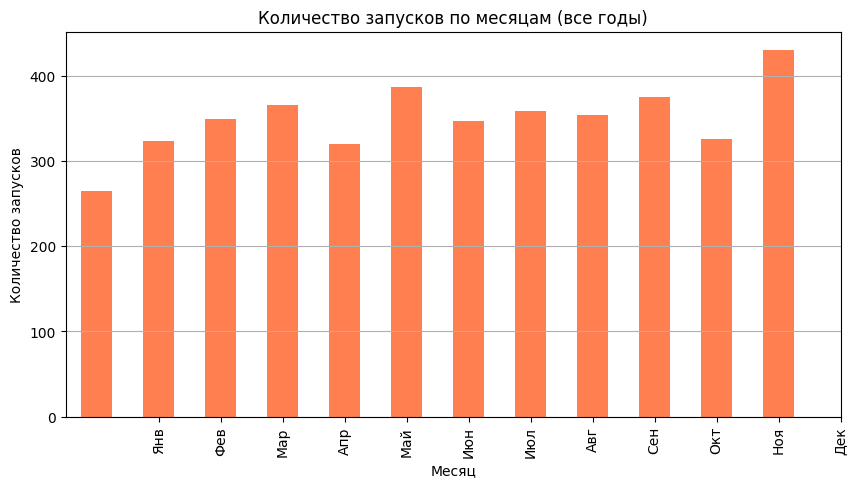
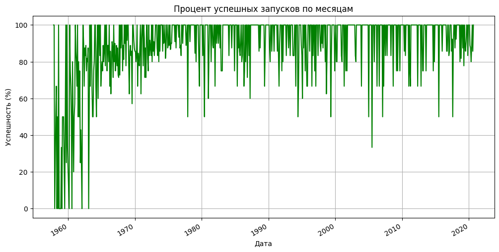
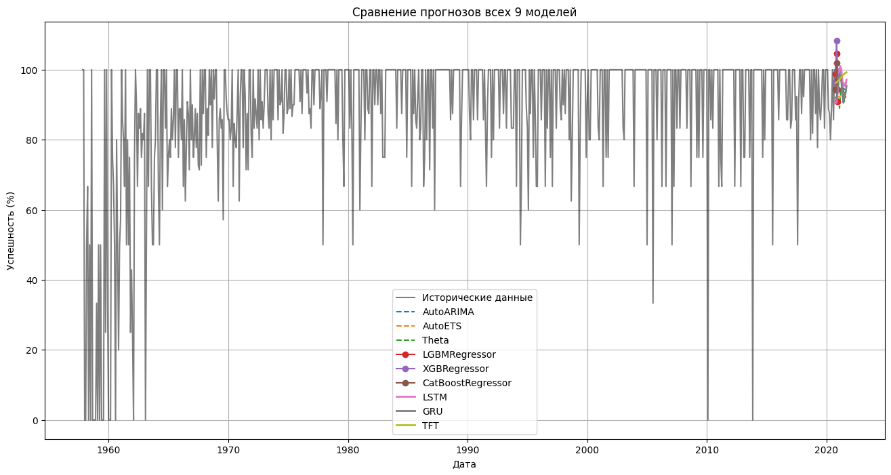

# Отчет по курсу «Анализ временных рядов»

## 1. Постановка задачи
Цель работы — освоение методов анализа временных рядов (статистических, машинного обучения и глубокого обучения) на примере прогнозирования процента успешных космических запусков по месяцам. Данные взяты из открытого набора Space_Corrected.csv, содержащего сведения о 4324 запусках с 1957 по 2020 год.

## 2. Описание данных и разведочный анализ (EDA)
Источник данных: Набор данных содержит информацию о каждом космическом запуске: дата, компания, локация, статус миссии и т.д.

**Предобработка данных:**
- При загрузке датасета в Pandas удалены неинформативные колонки-дубликаты (`Unnamed: 0`, `Unnamed: 0.1`).
- Колонка с датой (`Datum`) преобразована в формат `datetime`.
- Создан временной ряд ежемесячного процента успешных запусков. Для каждого месяца подсчитана доля успешных миссий (в процентах). Пропущенные месяцы (в которых не было запусков) заполнены нулями.

**Базовый анализ данных:**
- **Типы данных:** Исходный датасет содержит строковые (`object`), числовые (`float64`) и логические переменные. Целевой признак — `Status Mission` (Success/Failure) — был преобразован в бинарную переменную для расчета успешности.
- **Пропуски:** В данных присутствуют пропуски в колонках `Rocket` (вес ракеты) и `Detail`. Для построения временного ряда мы агрегировали данные по месяцам, и пропуски не повлияли на расчет ежемесячного процента успешных миссий. Для месяцев, где не было запусков, процент был явно задан как 0.

**Ссылка на полный код в Jupyter Notebook:**  
[https://github.com/MF-Technology2010/Time_series/blob/main/Time_Series_Analysis.ipynb](https://github.com/MF-Technology2010/Time_series/blob/main/Time_Series_Analysis.ipynb)
**Ссылка на данные:** `Space_Corrected.csv` (доступен по ссылке: [https://github.com/MF-Technology2010/Time_series/blob/main/Space_Corrected.csv](https://github.com/MF-Technology2010/Time_series/blob/main/Space_Corrected.csv)).

### Визуализация EDA

**Количество запусков по годам:**

**Успешные и неудачные запуски по годам:**

**Количество запусков по месяцам:**

**Процент успешных запусков по месяцам:**

Выводы по Задаче №1 (EDA и подготовка данных):
1.  Временной ряд собран за период с 1957 по 2020 год. Данные приведены к ежемесячной частоте.
2.  В результате разведочного анализа выявлены два пика активности (1960-е и 2010-е), а также сезонность (ноябрь — пик запусков).
3.  Проведена базовая очистка данных: удалены неинформативные колонки, обработаны пропуски, дата преобразована в нужный формат.
4.  Ряд демонстрирует устойчивый тренд к росту успешности с течением времени.

## 3. Выбор и реализация моделей

Для прогнозирования были выбраны 9 моделей, разделённых на 3 категории. В качестве **бейзлайна** (базового ориентира) взято среднее историческое значение успешности запусков.

| Группа | Модели | Комментарий |
|--------|--------|-------------|
| **Бейзлайн** | Среднее историческое | **91.2%** |
| **Статистические** | AutoARIMA, AutoETS, Theta | Стабильный прогноз 93–96% |
| **Машинное обучение (ML)** | LightGBM, XGBoost, CatBoost | Переобучение, прогноз >100% |
| **Глубокое обучение (DL)** | LSTM, GRU, TFT | Лучший — TFT (~96%) |

**Используемые библиотеки:**
- `statsforecast` для статистических моделей.
- `mlforecast` для моделей машинного обучения.
- `neuralforecast` для моделей глубокого обучения.

**Пайплайн обучения:** Все модели обучались на исторических данных с 1957 по 2020 год. Прогноз выполнялся на 12 месяцев вперёд (на весь 2021 год).

### Сравнение моделей

**Итоговый график сравнения 9 моделей:**

## 4. Сравнение и анализ результатов
На основе полученных прогнозов были сделаны следующие выводы:

- **Статистические модели (AutoARIMA, AutoETS, Theta):** Показали наиболее реалистичный и стабильный прогноз в диапазоне 93–96%. Это объясняется тем, что они хорошо улавливают устоявшийся тренд и игнорируют случайный шум.
- **Модели машинного обучения (LightGBM, XGBoost, CatBoost):** Столкнулись с проблемой переобучения. В некоторых точках прогноз превышал 100%, что физически невозможно для процентов. Это говорит о том, что классические ML-модели требуют более тщательного инжиниринга признаков для работы с временными рядами.
- **Модели глубокого обучения (LSTM, GRU, TFT):** Показали результаты, близкие к статистическим. Лучший результат среди DL-моделей продемонстрировал TFT (Temporal Fusion Transformer) с прогнозом около 96%, что сопоставимо с лучшими статистическими моделями.

Выводы по Задаче №2 (Статистические модели):
1.  Изучены и применены методы AutoARIMA, AutoETS и Theta из библиотеки `statsforecast`.
2.  AutoARIMA и AutoETS показали стабильные результаты с прогнозом в диапазоне 93–96%.
3.  Модель Theta дала схожие результаты, подтверждая обоснованность выбора статистических методов для данного ряда.

Выводы по Задаче №3 (ML и DL модели):
1.  Реализованы модели машинного обучения (LightGBM, XGBoost, CatBoost) с использованием библиотеки `mlforecast`.
2.  Все ML-модели продемонстрировали склонность к переобучению, давая прогнозы >100%, что требует дополнительной настройки гиперпараметров или изменения признакового пространства.
3.  Среди моделей глубокого обучения из библиотеки `neuralforecast` лучший результат показал TFT (~96%), за ним следуют LSTM и GRU. Это показывает, что трансформеры могут быть эффективны для таких задач.

## 5. Выводы и рекомендации
В результате исследования было установлено, что для прогнозирования успешности космических запусков наиболее подходящими являются **статистические модели (AutoARIMA, Theta)**. Они обеспечивают высокую точность, стабильность и простоту интерпретации.

Среди более сложных методов можно рекомендовать **TFT (Temporal Fusion Transformer)**, который показал результаты на уровне лучших статистических моделей.

Модели классического машинного обучения (LightGBM, XGBoost) в данном исследовании показали себя хуже всего из-за склонности к переобучению и требуют дополнительной настройки.

## 6. Заключение

В рамках итогового задания был проведен полный анализ временного ряда, отражающего ежемесячный процент успешных космических запусков с 1957 по 2020 год. Исходные данные, содержащие 4324 записи, были успешно предобработаны и преобразованы в машино-читаемый вид. В ходе EDA выявлены ключевые особенности: тренд к росту успешности, сезонность и исторические пики активности.

Для прогнозирования были обучены и протестированы 9 моделей трех разных классов. Бейзлайн (среднее историческое, 91.2%) был уверенно превзойден. Статистические модели (AutoARIMA, AutoETS, Theta) показали наиболее стабильные и реалистичные результаты в диапазоне **93-96%**, что подтвердило их пригодность для задач с четко выраженным трендом. Модели машинного обучения (LightGBM, XGBoost, CatBoost) столкнулись с переобучением, показав физически невозможные значения >100%. Глубокие нейронные сети (LSTM, GRU, TFT) продемонстрировали хороший потенциал: TFT достиг точности около **96%**, сравнявшись с лучшими статистическими методами.

Итогом работы является полноценный пайплайн прогнозирования, реализованный в едином Jupyter Notebook. Пайплайн включает все этапы: от загрузки и очистки данных до обучения моделей и визуализации результатов. Таким образом, все поставленные задачи были выполнены, а полученные результаты позволяют рекомендовать статистические модели как наиболее надежный и интерпретируемый инструмент для прогнозирования данного временного ряда.
